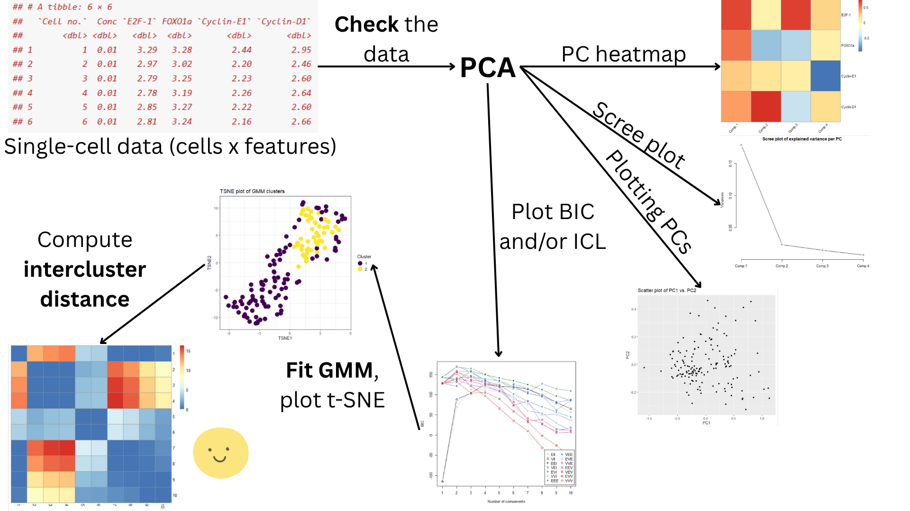

<!-- README.md is generated from README.Rmd. Please edit that file -->

# clustsimlR

<!-- badges: start -->

<!-- badges: end -->

Compute a Covariance-based Inter-cluster Similarity Metric

## Description

Provides functions for single-cell data clustering analysis, with the
use of within-cluster covariances to characterise a cluster and to
assess similarity or difference between clusters. Functions for data
preprocessing and dimensionality reduction, for clustering (by Gaussian
Mixture Modelling) and for data visualisation are provided. This aims to
provide the user with a simple interface to conduct single-cell
clustering analysis in a manner that takes into account the finer shape
of the clusters and how this shape differs between them, which is a
concept that is not widely explored in clustering analysis. This package
aims to achieve this by offering functionalities to compute an
inter-cluster distance metric designed for covariance matrices which can
be inferred through clustering analyses such as GMM (Förstner & Moonen,
2003).

### Specifications of machine used to develop `clustsimlR`

R version 4.5.1 (2025-06-13 ucrt) <br> Platform: x86_64-w64-mingw32/x64

## Installation

To install the latest version of the package:

``` r
install.packages("devtools")
library("devtools")
devtools::install_github("laaeett/clustsimlR", build_vignettes = TRUE)
library("clustsimlR")
```

To run the shinyApp:

``` r
run_clustsimlR()
```

## Overview:

``` r
ls("package:clustsimlR") # lists functions in clustsimlR
data(package = "clustsimlR") # lists datasets
browseVignettes("clustsimlR") # load vignettes
```

`clustsimlR` contains the following 9 functions.

1.  ***check_everything*** for checking the data to be analysed for
    missing data and zero-inflation

2.  ***PCA*** for conducting PCA on the data, with functionality to plot
    a Scree plot and a heatmap of PC coefficients

3.  ***plot_PC*** for plotting a scatter plot of the PC scores with
    respect to two PCs

4.  ***plot_loss*** for plotting the BIC and ICL values for different
    models for Gaussian Mixture Modelling, for different numbers of
    clusters fitted

5.  ***fit_GMM*** for clustering by Gaussian Mixture Modelling

6.  ***plot_GMM_clusters*** for plotting a t-SNE of the data, coloured
    by cluster membership

7.  ***calculate_dist*** for computing the distance between two
    covariance matrices, using the metric described by Förstner &
    Moonen, (2003)

8.  ***intercluster_dist*** for computing a distance matrix based on
    inter-distances between within-cluster covariance matrices from GMM
    analysis, with functionality to plot a heatmap of the distance
    matrix.

9.  ***run_clustsimlR*** for launching a Shiny app for this package.

The package also includes one sample dataset, called “dasatinib”.

For more information, please refer to the vignette and the help
documentation available. An overview of the package is also illustrated
in the image below:



## Contributions:

The author of the package is Laeticia Liawas. The author wrote the 8
functions included with the package, while making use of external
packages. `check_everything` is a function to check for missing values
and zero-inflation, and to fix them if desired by the user. This
function makes use of the `Hmisc::impute` function from the `Hmisc`
package for imputation of missing values. `PCA` is a function for
conducting PCA on the data, and to plot a Scree plot and a heatmap of PC
coefficients if desired. The function makes use of the `stats::princomp`
and the `stats::screeplot` functions from the `stats` package for
conducting PCA and plotting a Scree plot. The function also makes use of
the `pheatmap` and `grid` package to generate a heatmap of the PC
coefficients. `plot_PC` is a function to create a scatter plot of PCA
scores with respect to 2 PCs. The function makes use of the `ggplot2`
package for scatter plot plotting. `plot_loss` is a function to plot the
BIC and the ICL value for plotting the BIC and ICL values for different
models for Gaussian Mixture Modelling, for different numbers of clusters
fitted. `fit_GMM` is a function for running GMM analysis itself. This
function and the previous function makes use of the `mclust` package for
GMM fitting, and for computing BIC and ICL values. `plot_GMM_clusters`
is a function for plotting a t-SNE plot, coloured by cluster membership.
This function makes use of the `Rtsne` and `ggplot2` package for running
the t-SNE algorithm and for plotting. `calculate_dist` is a function for
computing the distance between two covariance matrices. The function
makes use of the `expm` package for matrix operations such as logarithm
and square root. `intercluster_dist` is a function to compute a distance
matrix for clusters from GMM, and to plot a heatmap of this distance
matrix. This function also uses the package `pheatmap` for generating
heatmaps. `run_clustsimlR` is a function to launch a Shiny app for the
package. This functions makes use of the `shiny`, `bslib`,
`shinycssloaders` and `shinyalert` packages for building the app. AI
tools were used during debugging for the functions.

## References:

- Attali, D., Edwards, T. (2024). *shinyalert: Easily Create Pretty
  Popup Messages (Modals) in ‘Shiny’*.
  <doi:10.32614/CRAN.package.shinyalert>
  <https://doi.org/10.32614/CRAN.package.shinyalert>, R package version
  3.1.0, <https://CRAN.R-project.org/package=shinyalert>.

- Attali, D., Sali, A. (2024). *shinycssloaders: Add Loading Animations
  to a ‘shiny’ Output While It’s Recalculating*.
  <doi:10.32614/CRAN.package.shinycssloaders>
  <https://doi.org/10.32614/CRAN.package.shinycssloaders>, R package
  version 1.1.0, <https://CRAN.R-project.org/package=shinycssloaders>.

- Bache, S., Wickham, H. (2025). *magrittr: A Forward-Pipe Operator for
  R*. <doi:10.32614/CRAN.package.magrittr>
  <https://doi.org/10.32614/CRAN.package.magrittr>, R package version
  2.0.4, <https://CRAN.R-project.org/package=magrittr>.

- Bates, D., Maechler, M., Jagan, M. (2025). *Matrix: Sparse and Dense
  Matrix Classes and Methods*. <doi:10.32614/CRAN.package.Matrix>
  <https://doi.org/10.32614/CRAN.package.Matrix>, R package version
  1.7-3, <https://CRAN.R-project.org/package=Matrix>.

- Biernacki, C., Celeux, G., & Govaert, G. (2000). Assessing a mixture
  model for clustering with the integrated completed likelihood. ,
  22(7), 719–725. <https://doi.org/10.1109/34.865189>

- Chang, W., Cheng, J., Allaire, J., Sievert, C., Schloerke, B., Xie,
  Y.,Allen, J., McPherson, J., Dipert, A., Borges, B. (2025). *shiny:
  Web Application Framework for R*. <doi:10.32614/CRAN.package.shiny>
  <https://doi.org/10.32614/CRAN.package.shiny>, R package version
  1.11.1, <https://CRAN.R-project.org/package=shiny>.

- Fraley, C., & Raftery, A. E. (2002). Model-based clustering,
  discriminant analysis and density estimation. , 97(458), 611-631.

- Fraley, C., & Raftery, A. E. (2007). Bayesian regularization for
  normal mixture estimation and model-based clustering. , 24(2),
  155-181.

- Förstner, W., & Moonen, B. (2003). A Metric for Covariance Matrices.
  In Geodesy-The Challenge of the 3rd Millennium (pp. 299–309). Springer
  Berlin Heidelberg. <https://doi.org/10.1007/978-3-662-05296-9_31>

- Harrell Jr, F. (2025). *Hmisc: Harrell Miscellaneous*.
  <doi:10.32614/CRAN.package.Hmisc>
  <https://doi.org/10.32614/CRAN.package.Hmisc>, R package version
  5.2-4, <https://CRAN.R-project.org/package=Hmisc>.

- Jesse H. Krijthe (2015). Rtsne: T-Distributed Stochastic Neighbor
  Embedding using a Barnes-Hut Implementation, URL:
  <https://github.com/jkrijthe/Rtsne>

- Jolliffe, I. T. (2002). , 2nd Edition, New York: Springer.

- Kantarjian, H., Jabbour, E., Grimley, J., & Kirkpatrick, P. (2006).
  Dasatinib. , 5(9), 717–718. <https://doi.org/10.1038/nrd2135>

- Kolde R (2025). *pheatmap: Pretty Heatmaps*.
  <doi:10.32614/CRAN.package.pheatmap>
  <https://doi.org/10.32614/CRAN.package.pheatmap>, R package version
  1.0.13, <https://CRAN.R-project.org/package=pheatmap>.

- Koleti, A., Terryn, R., Stathias, V., Chung, C., Cooper, D. J.,
  Turner, J. P., Vidović, D., Forlin, M., Kelley, T. T., D’Urso, A.,
  Allen, B. K., Torre, D., Jagodnik, K. M., Wang, L., Jenkins, S. L.,
  Mader, C., Niu, W., Fazel, M., Mahi, N., … Schürer, S. C. (2018). Data
  Portal for the Library of Integrated Network-based Cellular Signatures
  (LINCS) program: integrated access to diverse large-scale cellular
  perturbation response data. , 46(D1), D558–D566.
  <https://doi.org/10.1093/nar/gkx1063>

- Lin, J.-R., Fallahi-Sichani, M., & Sorger, P. K. (2015). Highly
  multiplexed imaging of single cells using a high-throughput cyclic
  immunofluorescence method. , 6(1), 8390.
  <https://doi.org/10.1038/ncomms9390>

- Maechler M, Dutang C, Goulet V (2024). *expm: Matrix Exponential, Log,
  ‘etc’*. <doi:10.32614/CRAN.package.expm>
  <https://doi.org/10.32614/CRAN.package.expm>, R package version 1.0-0,
  <https://CRAN.R-project.org/package=expm>.

- Scrucca L, Fraley C, Murphy TB, Raftery AE (2023). *Model-Based
  Clustering, Classification, and Density Estimation Using mclust in R*.
  Chapman and Hall/CRC. ISBN 978-1032234953, <doi:10.1201/9781003277965>
  <https://doi.org/10.1201/9781003277965>,
  <https://mclust-org.github.io/book/>.

- Sievert, C., Cheng, J., Aden-Buie, G. (2025). *bslib: Custom
  ‘Bootstrap’ ‘Sass’ Themes for ‘shiny’ and ‘rmarkdown’*.
  <doi:10.32614/CRAN.package.bslib>
  <https://doi.org/10.32614/CRAN.package.bslib>, R package version
  0.9.0, <https://CRAN.R-project.org/package=bslib>.

- Upton, G., & Cook, I. (2014). Scree plot. In . Oxford University
  Press.

- van der Maaten, L. J. P.(2014). Accelerating t-SNE using Tree-Based
  Algorithms. Journal of Machine Learning Research 15(Oct):3221-3245,
  2014.

- van der Maaten, L.J.P. & Hinton, G.E., (2008). Visualizing data using
  t-SNE. , 9(86), 2579-2605.

- Wickham, H. (2016). ggplot2: Elegant Graphics for Data Analysis.
  Springer-Verlag New York.

- Wickham H, François R, Henry L, Müller K, Vaughan D (2023). *dplyr: A
  Grammar of Data Manipulation*. <doi:10.32614/CRAN.package.dplyr>
  <https://doi.org/10.32614/CRAN.package.dplyr>, R package version
  1.1.4, <https://CRAN.R-project.org/package=dplyr>.

## Acknowledgements:

This package was developed as part of an assessment for 2025 BCB410H:
Applied Bioinformatics course at the University of Toronto, Toronto,
CANADA. `clustsimlR` welcomes issues, enhancement requests, and other
contributions. To submit an issue, use the [GitHub
issues](https://github.com/laaeett/clustsimlR/issues).

## Other Topics:
